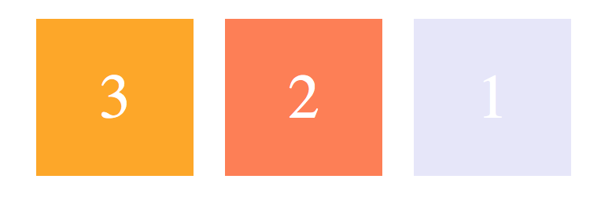
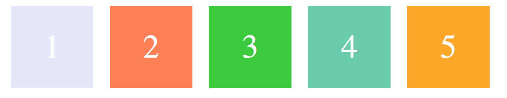
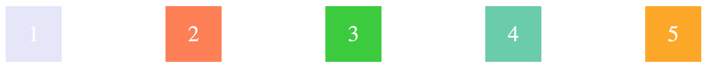
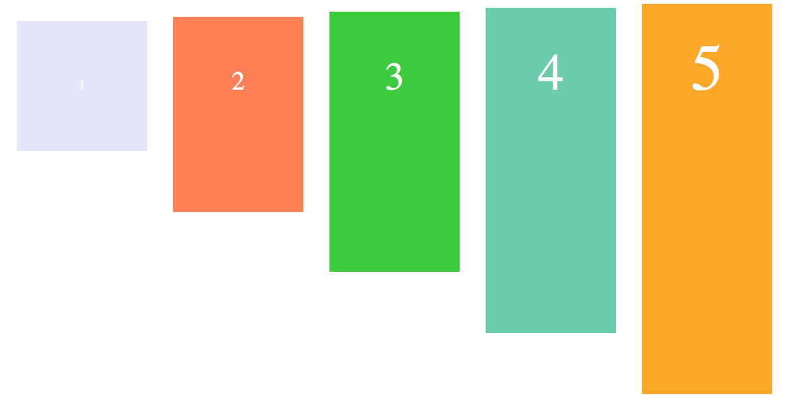
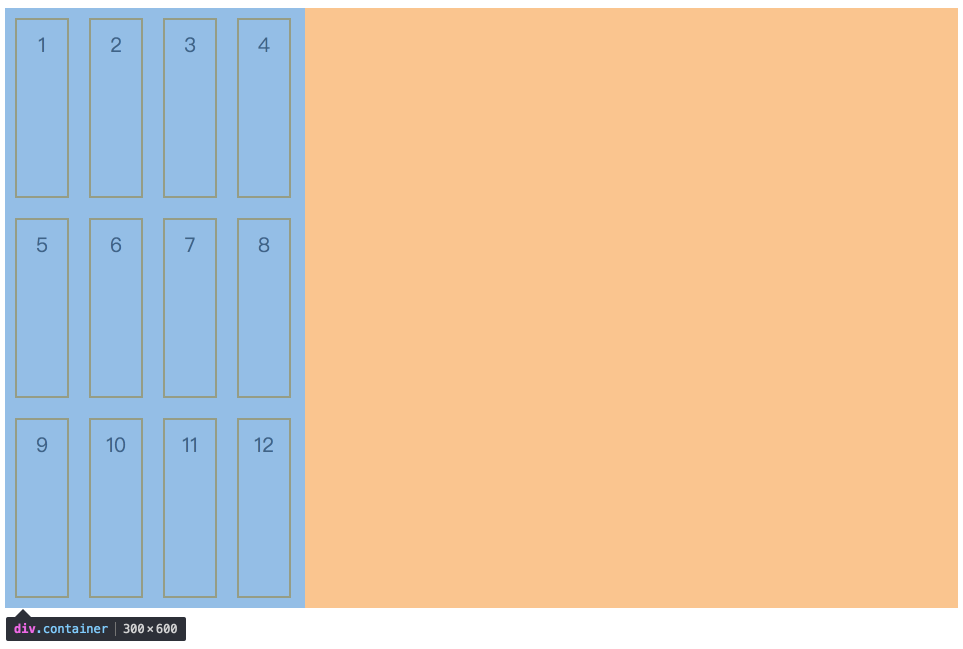
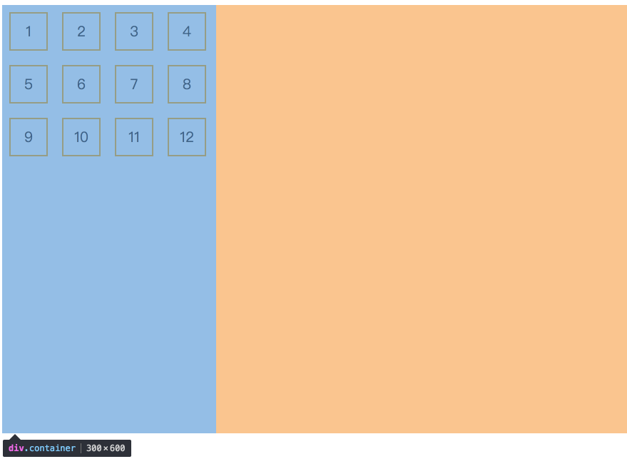
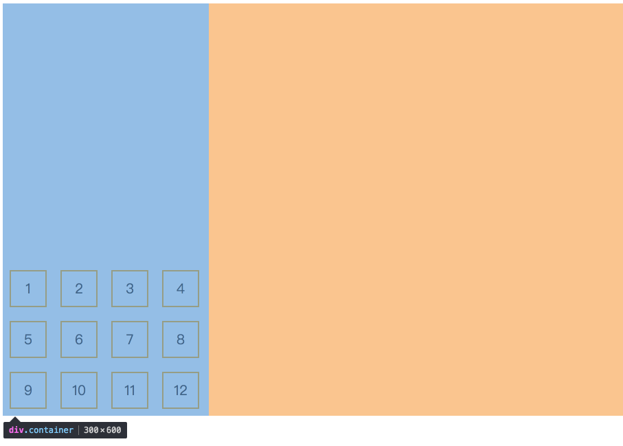
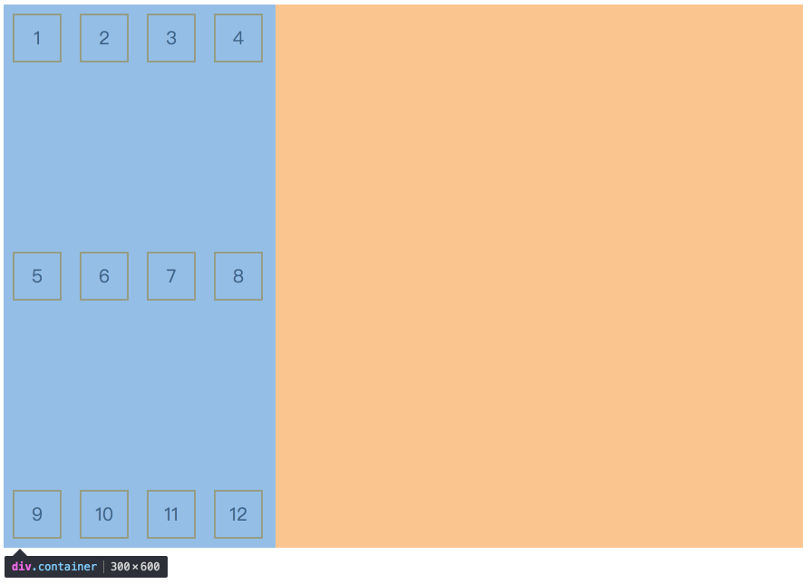

# display :flex

## flex 基本概念


> 在 flex 容器中默认存在两条轴，水平轴（main-asix）和垂直交叉轴（corss-asix），这是默认的设置，当然也可以修改默认的水平的 main-asix 为垂直的 main-asix
> 在容器中每个单元块被称之为 flex item，每个项目占据的主轴为 main-size，占据的交叉轴为 corss-size，这个还要取决于你定义的主轴时水平方向还是垂直方向

### flex 容器

首先，实现 flex 布局先需要指定一个容器，任何的容器都可以指定为 flex 布局，这个容器的元素可以使用 flex 布局。

```css
.container {
  display: flex|inline-flex;
}
```

分别可以生产块级的 flex 盒子或者是行内的 flex 盒子，取决于你定义在块级元素里还是行内元素里，同时相应的应使用 flex，亦或是 inline-flex
⚠️：需要注意的是：当时设置 flex 布局之后，子元素的 float、clear、vertical-align 的属性将会失效。

### flex 的属性

> flex-direction
> flex-wrap
> flex-flow
> justify-content
> align-item
> align-content

#### flex-direction 决定了主轴的方向（项目的排列方向）

```css
.container {
  display: flex;
  flex-diretion: row|row-reverse|column|column-reverse;
}
```

1.默认值，row 方向：水平向右

2.row-reverse 方向：水平向左

3.column 方向：垂直向上

4.column 方向：垂直向下


#### flex-wrap 决定容器内项目是否换行

 ```css
.container{
    display:flex;
    flex-warp:nowarp|warp|warp-reverse;
}
 ```

 1.默认值,nowarp不换行，当主轴固定时，当项目的空间不足时，项目尺寸会随之调整，并不会到下一行

 2.warp，项目主轴总尺寸超过容器时，项目换行，第一行下上
 
 3.warp-reverse，项目主轴总尺寸超过容器时，项目换行，第一行在最下面
 

#### flex-flow:flex-diretion,flex-warp的简写

#### justify-content 定义项目在主轴的对齐方式

```css
.container{
    display:flex;
    justify-content:flex-start|flex-end|center|space-between|space-around
}
```

1.默认值 flex-start 左对齐

2. flex-end 右对齐

3. space-around 每个项目两侧的间隔相同

4. space-between 两端对齐，项目中间相隔相同

5. center 水平据居中


#### align-items定义交叉轴的对齐方式

```css
.container{
    diaplay:flex;
    align-items:flex-start|flex-end|center|baseline|stretch
}
```

1.默认值，stretch 即如果项目未设置高度或者设为 auto，将占满整个容器的高度

2.flex-start：交叉轴的起点对齐

3.flex-end：交叉轴的终点对齐

4.center：交叉轴的中点对齐

5.baseline: 项目的第一行文字的基线对齐


#### align-content: 定义了多根轴线的对齐方式，如果项目只有一根轴线，那么该属性将不起作用

```css
.container{
     align-content: flex-start | flex-end | center | space-between | space-around | stretch;
}
```

flex-wrap 设置为 nowrap 的时候，容器仅存在一根轴线，因为项目不会换行，就不会产生多条轴线。所以用不到align-content
flex-wrap 设置为 wrap 的时候，容器可能会出现多条轴线，这时候你就需要去设置多条轴线之间的对齐方式了。
建立在主轴为水平方向时测试，即 flex-direction: row, flex-wrap: wrap;

1.默认值为 stretch(设置高度)

没有设置高度的情况

2.flex-start：轴线全部在交叉轴上的起点对齐

3.flex-end：轴线全部在交叉轴上的终点对齐

4.center：轴线全部在交叉轴上的中间对齐

5.space-between：轴线两端对齐，之间的间隔相等，即剩余空间等分成间隙。

6.space-around：每个轴线两侧的间隔相等，所以轴线之间的间隔比轴线与边缘的间隔大一倍。


### flex项目的属性

- order
- flex-basis
- flex-grow
- flex-shrink
- flex
- align-self

#### 1.order:定义项目在容器中的排列顺序，数值越小，排列越靠前，默认值0

```css
.item{
order:<integer>;
}
```


在HTML的结构中虽然-2，-1的item拍在后面，但是由于分别设置了order，使之能排在前面

#### 2.flex-basis:定义了在分配多余空间之前，，项目占据的主轴空间，浏览器根据这个属性，计算主轴是否有多余的空间

```css
.item{
  flex-basis:<length>|auto;
}
```

默认值：auto,即项目本来的大小，这时候item的宽高取决于width或者height的值。
在主轴为水平方向的时候，当设置了flex-basis，项目的宽设置值会失效，flex-basis的值为项目的宽，flex-basis需要跟flex-grow和flex-shrink配合使用才会发挥效果

- 当flex-basis的值为0%的时候，是把该项目的尺寸设置为哦，故即使设置该尺寸为100px，也并没有什么用
- 当flex-basis的值为auto，根据尺寸的设定值width：200px，则200px不会被纳入剩余空间。

#### flex-grow定义项目的放大比例

```css
.item{
  flex-grow:<number>
}
```

默认值0，即使有剩余空间也不会放大

#### flex-shrink定义项目的缩小比例

```css
.item{
  flex-shrink: <number>
}
```

默认值0，即使没有剩余空间也不会缩小

#### flex:flex-grow,flex-shrink,flex-basis的缩写

```css
.item{
  flex:none|[<'flex-grow'><'flex-shrink'>?|<'flex-basis'>]
}
```

```css
.item{
  flex:1;
}
.item{
  flex-grow:1;
  flex-shrink:1;
  flex-basis:0%;
}
```

```css
.item{
  flex:0;
}
.item{
  flex-grow:0;
  flex-shrink:1;
  flex-basis:0%;
}
```

```css
.item{
  flex:0%;
}
.item{
  flex-grow:1;
  flex-shrink:1;
  flex-basis:0%;
}
```
